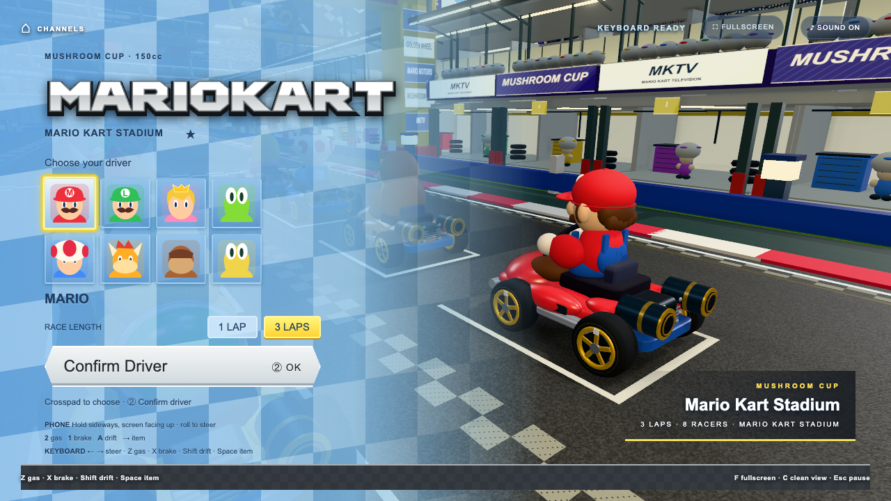
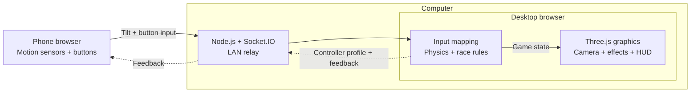

# 🕹 OpenWii

Your phone is the controller. Your computer runs the games.

OpenWii is a browser game collection controlled by your phone's motion sensors
and buttons. Scan a QR code on your computer to connect—no phone app or extra
hardware required. Games share a Wii-style launcher and remote. Up to four
phones can join; each game's player count is listed below.

## Games

| Game | How to play | Players |
| --- | --- | --- |
| 🏎️ **[Mario Kart](games/mario-kart/)** | Hold your phone sideways to steer. Race through a stadium with drifting, boosts, items, anti-gravity and gliding. Choose from eight drivers and race one or three laps. | 1 human + 7 CPU racers |
| 🍉 **[Fruit Ninja](games/fruit-ninja/)** | Swing the phone like a sword. Slice fruit, dodge bombs and build combos. | Up to 4 |
| 👾 **[Alien Attack](games/alien-attack/)** | Hold the phone flat like a tray, tilt to fly and press A to fire. | 1 |
| 🎯 **[Shooting Range](games/shooting-range/)** | Point and press A to hit targets against the clock. | 1 |
| 🎨 **[Sketch](games/drawing/)** | Point at the canvas and press A to draw. Choose colors, brushes and an eraser. | 1 |

**About the Mario Kart demo:** this repository includes a playable fan-made
browser recreation with a generated stadium, procedural characters and
synthesized audio. The original-game models, track, fonts and sound recordings
used in the polished video demo are **not included**. A fresh clone works without
them, but will look and sound different. See [assets and demo modes](#assets-and-demo-modes).



## Quick start

You need:

- **Node.js 22 or newer** and npm, for the server and development/test commands.
- **OpenSSL on your PATH**, for the local HTTPS certificate.
- A computer browser with **WebGL 2** support. Browser checks use Google Chrome.
- A phone browser with motion-sensor support, on the **same Wi-Fi** as the computer.

```bash
git clone https://github.com/pattssun/OpenWii.git
cd OpenWii
npm ci
npm start
```

1. Open the **Launcher** URL printed in the terminal, normally
   **https://localhost:8443/**. On macOS, the server opens Google Chrome in a
   separate profile automatically; elsewhere, open the URL yourself.
2. Scan the launcher's QR code with your phone. It points to the computer's LAN
   address. Accept the self-signed certificate warning for your local server,
   then tap **Enable motion sensors** and allow access if prompted.
3. Choose a game on the computer, or point at a launcher tile with the phone and
   press **A**. Mario Kart is the first tile.
4. Stop the server with **Ctrl+C** when finished.

OpenWii runs one shared session on your local network. It is intended for local
play, without internet matchmaking or isolated public rooms.

**Phone sensors require HTTPS.** If OpenSSL is unavailable, the main server falls
back to HTTP and reports that phone motion will not work. Install OpenSSL and
restart. On a phone, `localhost` refers to the phone itself—use the QR code or
**Phone remote** address printed by the server.

For pointer games, **A** acts, **B / Home** returns to the launcher, **− / +**
adjusts pointer speed, and **1** recenters the cursor. Their pointer learns from
motion automatically. Mario Kart uses the steering controls below.

## Playing Mario Kart

Hold the phone sideways with the **crosspad on the left and 1 / 2 on the right**,
screen mostly facing up. Roll it like a steering wheel to turn. The remote keeps
its physical button arrangement when the browser changes orientation; on iPad,
the controls scale up to fit the screen.

1. Choose a driver with the crosspad and press **2** to confirm.
2. Choose **1 lap or 3 laps** with left/right, then press **2** again to start.
   The game remembers your lap choice. Press **1** here to change driver.
3. Hold the phone level and still for a moment. The countdown waits until the
   steering wheel has a stable neutral position. Hold **2** after GO to accelerate.

| Action | Phone remote | Computer keyboard |
| --- | --- | --- |
| Steer | Tilt left / right | ← / → |
| Accelerate | Hold **2** | Hold **Z** |
| Brake / reverse | Hold **1** | Hold **X** |
| Drift | Hold **A** while turning | Hold **Shift** while turning |
| Release drift boost | Release **A** | Release **Shift** |
| Use item | Crosspad **→** | **Space** |
| Confirm / resume | **2** | **Enter** |
| Recenter steering | **−**, then level the phone and resume | **R** |
| Return to launcher | **Home** | Click **Channels** |

Choose a driver and race length with the mouse or keyboard if no phone is
connected. **Esc** pauses/resumes, **F** toggles fullscreen, **C** toggles a clean
view, and the **Sound** button mutes the game. If steering feels reversed, press
**I** on the computer to invert it. Hiding the game or losing the phone connection
pauses the race; reconnect and press **2 / Enter** to resume.

Drifting builds blue, orange, then purple sparks; release it for a mini-turbo.
Item boxes award power-ups, coins raise top speed, and ramps deploy the glider
automatically. The leaderboard appears after the finish cue, with the race
continuing behind it. Mario Kart currently supports **one phone driver** against
seven computer-controlled racers, using the first phone's player slot.

## Assets and demo modes

**Normal play requires no asset downloads, Blender installation or build step.**
The game creates its fallback models, course and audio at runtime. Optional local
files under `assets/` and `audio/` are ignored by Git and are not part of the
software release.

- **Generated model pack:** `npm run build:kart-assets` optionally generates GLBs
  with Blender. The script defaults to Blender's macOS application path; set
  `BLENDER` to your executable on other systems. This replaces the local character
  manifest, so preserve an existing custom manifest before rebuilding.
- **Locally supplied source models/course:** [conversion documentation](games/mario-kart/pipeline/SOURCE-ASSETS.md)
  describes the expected inputs and tools. These scripts do not download or
  bundle the original artwork. Missing optional files fall back to the generated
  game. Add `?sourceCourse=0` to the game URL to force the generated course.
- **Audio:** synthesized sound works out of the box. [Audio documentation](games/mario-kart/AUDIO.md)
  describes optional local overrides and sample packs.

To run the separate, silent prototype used to film the development process:

```bash
npm run test
```

This starts its own HTTPS server on **8444** and shows a phone-pairing QR code.
It includes steering, drifting, boosts, a parachute jump and large readouts.
Keys **1–4** show graphics stages with a camera orbit; **5** tours the finished
track; **0** returns to driving. The driving test and stages **1–2** work from a
fresh clone. Stages **3–5** require the optional local source models/course and
show an explanatory message when those files are missing.

These are reconstructed presentation stages, not historical versions of the
project. See the [prototype guide](tests/kart-prototype/README.md) for controls
and recording instructions. This demo does not appear in the launcher.

## Troubleshooting

| Symptom | What to check |
| --- | --- |
| Phone cannot open the QR link | Use the same Wi-Fi, allow Node.js through the computer's firewall, and avoid guest-network client isolation. If the computer has multiple network adapters, try the correct LAN address with the printed port and `/controller`. |
| Buttons work but motion does not | Verify the phone URL starts with `https://`, accept the local certificate, and enable motion sensors. Reload and grant motion permission again if necessary. |
| Countdown waits for the wheel | Hold the phone sideways, face up and level, without steering briefly. Use **−** to recenter. |
| Black screen or poor performance | Check WebGL 2 / hardware acceleration in the desktop browser; reduce the window size and close other GPU-heavy tabs. |
| No sound | Click the game and start a race to unlock browser audio, then check the Sound button and device volume. A fresh clone uses synthesized cues. |
| Port already in use | Stop the previous server, or choose another `PORT`. The QR code uses that port automatically. |

Optional launch settings on macOS/Linux:

```bash
NO_OPEN=1 npm start               # Do not auto-open Chrome
PORT=8445 npm start               # Use another port
HTTP=1 NO_OPEN=1 npm start        # Desktop-only development; no phone motion
```

In Windows PowerShell, set environment variables before the command, for example
`$env:NO_OPEN="1"; npm start`. The normal `npm start` command works without these
settings. The default port is still 8443 in HTTP mode; use the scheme printed in
the terminal.

## How it works



The server serves the pages and forwards messages. The desktop browser owns the
game state. OpenWii supplies the shared controller, calibration and network link;
Mario Kart adds its racing simulation and Three.js presentation. Other games
reuse the same controller connection with their own input mapping and rendering.

## Development and checks

```bash
npm run test:unit                 # Automated unit tests for all games and core
npm audit                        # Check installed dependencies
```

With the main server running, and Google Chrome installed:

```bash
npm run test:kart-public          # Asset-free menu, controls, audio and full race
```

That browser check deliberately makes optional assets unavailable, drives a
one-lap race using keyboard events, and checks the finish/results/restart flow.
It writes screenshots and a report under the ignored
`games/mario-kart/evidence/public-release/` directory. Set `KART_URL` if using a
non-default server URL. Desktop automation does not replace testing motion and
permissions on a physical phone.

`npm run test:kart-browser` is the older **local asset-pack** review: it expects
eight GLBs and an HTTP server at `http://localhost:8080` (or `KART_URL`). Use
`test:kart-public` for a fresh clone. **`npm test` launches the interactive demo;
it does not run the unit suite.**

### Adding a game

Add a folder under `games/` with an `index.html`. The server discovers it at boot;
there is no registry to edit.

```text
games/your-game/
  index.html     loads Socket.IO and your game.js
  game.json      optional launcher title, tagline, emoji, players and order
  logic.js       game rules independent of rendering
  game.js        renderer and input integration
```

`core/channel.js` provides the shared pointer, player link and Home button.
`game.json` accepts `order` (lower comes first) and `hidden`. Older experiments
in `games/` are hidden from the launcher but remain available at their direct
`/games/<slug>/` URLs.

## License and attribution

The repository's software is [MIT licensed](LICENSE). Optional third-party
models, textures, fonts and recordings are not covered by that license and are
not distributed here. Keep local assets separate and use assets you have
permission to use when sharing your own build.

OpenWii is an independent fan project, not affiliated with or endorsed by
Nintendo. Wii, Mario Kart and related character names belong to Nintendo.
